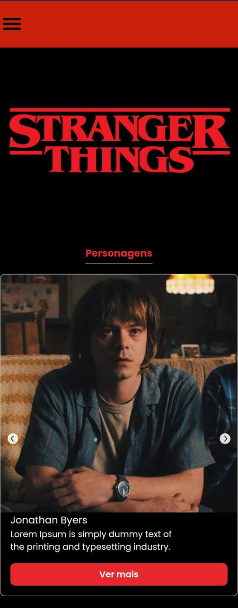

# Stranger Things

## Projeto em construção 🔨

Esse projeto tem como objetivo colocar em prática meus estudos sobre React.
 
No momento meu foco está em componentização, props, useState e useEffect.
 
O projeto está sendo construido com o conceito de mobile first.

## Tecnologias utilizadas 👩🏽‍💻

<a href="https://vitejs.dev/">Vite</a>
 
<a href="https://react.dev/">React</a>
 
<a href="https://www.typescriptlang.org/">TypeScript</a>
 
<a href="https://styled-components.com/">Styled Components</a>
 
<a href="https://mantine.dev/">Mantine UI</a>

## Link do projeto 🔗
<a href="https://stranger-things-sable.vercel.app/">Clique aqui</a>

## Última atualização 🌐

